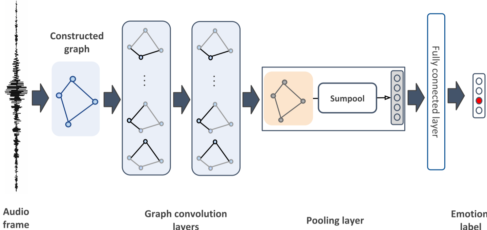

# Compact Graph Architecture for Speech Emotion Recognition

<br>

**Feb 02, 2021**
* First release of the project.

<br>


In this project, we propose a deep graph approach to address the task of speech emotion recognition. A compact, efficient and scalable way to represent data is in the form of graphs. Following the theory of graph signal processing, we propose to model speech signal as a cycle graph or a line graph. Such graph structure enables us to construct a Graph Convolution Network (GCN)-based architecture that can perform an accurate graph convolution in contrast to the approximate convolution used in standard GCNs. We evaluated the performance of our model for speech emotion recognition on the popular IEMOCAP database.

## Dependency installation

The code was successfully built and run with these versions:

```
pytorch-gpu 1.2.0
cudnn 7.6.4
cudatoolkit 10.0.130
opencv 3.4.2
scikit-learn 0.21.2

```
Note: You can also create the environment I've tested with by importing _environment.yml_ to conda.


<br>

## Preprocessing Data

The process for IEMOCAP database is in preprocess directory. The process converts the database into one txt file including graph structure and node attributes.

Note: you can download the processed data from [here](https://drive.google.com/file/d/1_3H_wByS-cSLLG7vrhgfvdzCnjaXJ2ui/view?usp=sharing) and put in this directory:

```
/dataset/
  IEMOCAP/
    IEMOCAP.txt
```


<br>

## Training

You can train the model with running main.py . 


```
usage: main_Inception.py

optional arguments:
  -h, --help          Show this help message and exit
  -device             Which gpu to use if any
  -batch_size         Input batch size for training
  -iters_per_epoch    Number of iterations per each epoch
  -epochs             Number of epochs to train
  -lr                 Learning rate
  --num_layers        Number of inception layers
  --hidden_dim        Number of hidden units for MLP
  --final_dropout     Dropout for classifier layer
  --Normalize         Normalizing data
  --patience          Patience for early stopping
```

<br>

## Reference 
If you found this repo useful give me a star!

[ArXiv's paper](https://arxiv.org/pdf/2008.02063)
```
@article{shirian2020compact,
  title={Compact Graph Architecture for Speech Emotion Recognition},
  author={Shirian, Amir and Guha, Tanaya},
  journal={arXiv preprint arXiv:2008.02063},
  year={2020}
}
```


<br><br><br>
